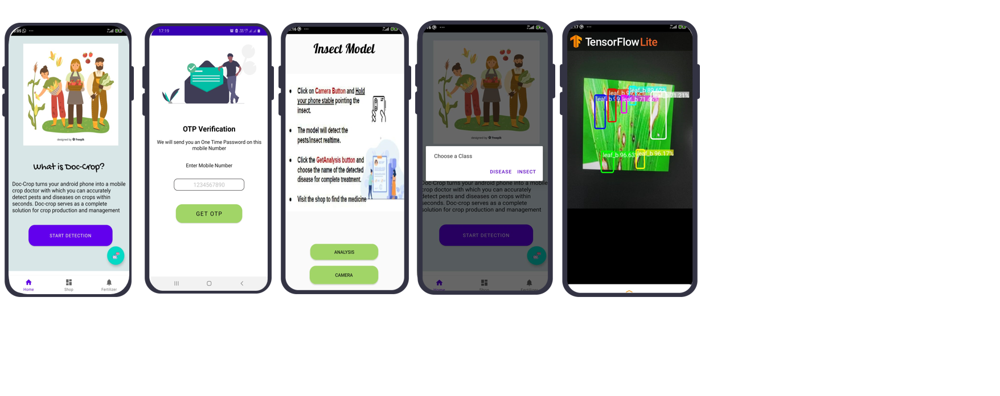

# Doc crop – paddy disease detection system

A paddy disease detection model project which works on the principle of CNN (Convolution Neural Network). 
Model can identify different types of disease such as Brown spot, leaf blast and hispa from images and can also identify different insects found in paddy crops such as stem bor, stem bore larvae, hispa, and gundi

## Use Case:

Our main focus is on farmers and those individuals who are into farming and gardening.
Our detection model is embedded into an android application which works in real time. Android application will be used by user to gain information about the diseases and insects on their crops and plants, along with remedies.
Chatbot functionality will act as an information guide where user can ask query about particular disease and can acquire preventive tips and suggestions.
Also, no technical expertise is required to use this application which makes it user-friendly application for farmers.

## 💾Datasets

Custom dataset has been collected from various sites and scraping techniques. There are two datasets used, one for diseases and other for pests. Sub-categories of datasets are
- Diseases: Brown spot, hispaa, leaf blast
- Pests: Gundhi Bug, Hispa, Stem bor lar, stem bor moth   
As we are using yolov4 framework so need to annotate each image. To annotate, roboflow tool is used. 
- The pests dataset contains around 160 images.
- The disease dataset contains around 300 images. 


##
## ⚒️ Tech used

-	[yolo v4](https://pjreddie.com/darknet/yolo/): object detection model
-	[Roboflow](https://roboflow.com/): used for annotation
-	[TensorFlow](https://www.tensorflow.org/): for mobile tflite model
-	[Firebase](https://firebase.google.com/): to store credentials of user
-	[Kommunicate](https://www.kommunicate.io/): for chat based	


## Tech Stack

**Client:** 

- Android
- Javascript
- CSS.. 

**Server:**

-	[yolo v4](https://pjreddie.com/darknet/yolo/): object detection model
-	[Roboflow](https://roboflow.com/): used for annotation
-	[TensorFlow](https://www.tensorflow.org/): for mobile tflite model
-	[Firebase](https://firebase.google.com/): to store credentials of user
-	[Kommunicate](https://www.kommunicate.io/): for chat based	


## ⬇️Installation


- Clone this repository using.
```bash    
    git clone 
```

- Cut the dataset folder and place it according to your choice like locally, or on drive and github.

- Open google colab on web browser and import the ipyb file. Alternatively, can use jupyter notebook but GPU issues will be there.

- After opening the file in colab, set the hardware accelerator to GPU by following these steps.

```bash 
    Click on Edit -> Notebook Settings –> Hardware Accelerator -> GPU.
```

- Now start executing each cell step by step and provide the path accordingly for the dataset wherever required.

- Other necessary steps are provided in ipynb file.

## Screenshots




## Extras

For object files and weights:

[Object file and weights](https://drive.google.com/drive/folders/1qoKE98A7zcZSDjzYcS-NpOwEfnDDLx7X?usp=sharing)

